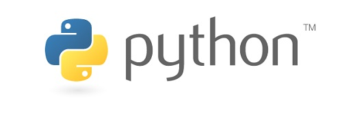

Python for Visual Basic programmers
=========================

A Python introdunction for Visual Basic programmers.

##Introduction

Python is a widely used high level programming language, its elegant syntax allows you to clearly define application behaviour using fewer lines of code than would be required in other languages like VB.  It supports multiple programming paradigms including imperative, functional and object oriented styles.  So you can do pretty much everything in it.

As a Visual Basic programmer the first thing you need to resign yourself to is not having the form designer.  Python is programmed in text.  You could still write desktop applications with buttons and menus though but the form layout must be described in code.  That is not covered in this document though.  However programs written in Python often don’t even need a desktop interface at all.

So this introduction is intended help a Visual Basic programmer apply their existing programming knowledge and experience to the world of Python on the Raspberry Pi.  This is by no means an exhaustive guide to Python.  For comprehensive documentation please visit: http://docs.python.org/2.7/

##Choosing a programming environment

###Desktop

You may have a preferred programming environment (the program to write code in) however if you need advice I can recommend a nice one called Geany.

Raspbian does not come with Geany so you have to install it.
To do this open up LXTerminal and enter the command below. 

`sudo apt-get install geany`

After the installation has completed you should find Geany inside the Programming folder of the launcher menu.  To start a new Python program go **File > New (with Template) > main.py**

Geany populates this with some template text (a copyright statement) and some function blocks at the bottom but you can delete everything except the first line to start afresh.  That first line is important because it denotes the file as a Python program.  The cogs icon at the top is the familiar run button (F5) similar to how it is in Visual Basic.

Enter the following code and press the run button.

`print "hello world"`

###Command line

If you prefer the command line you can easily create a Python program using `nano` or `vim`.  Nano is nice a terminal based text editor.  For example enter the following command.

`nano test.py`
